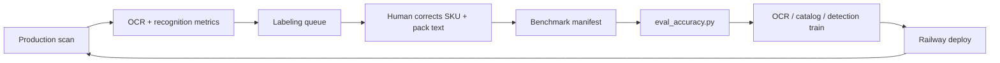

# Aislix cross-category accuracy improvement

Practical path to **95%+ SKU identification** across categories and subcategories — not one-off fixes per scan.

## The loop



| Stage | What | Tool |
|-------|------|------|
| **Measure** | Detection recall, OCR CER, SKU match by category | `scripts/eval_accuracy.py` |
| **Collect** | Low-confidence facings from any scan | `scripts/dump_scan_facings.py` → `export_labeling_queue.py` |
| **Label** | Brand, product, `ocr_label`, box | Lovable UI or CVAT |
| **Ingest** | Append to held-out benchmark | `scripts/import_corrections_to_manifest.py` |
| **Train OCR** | Paddle rec fine-tune | `scripts/prepare_ocr_finetune_dataset.py` + Colab |
| **Train vision** | YOLO / embeddings | `docs/GROCER_HELP_TRAIN.md`, `merge_learned_into_base.py` |
| **Gate** | Block deploy if accuracy drops | `eval_accuracy.py --min-product-accuracy 95` |

---

## 1. Benchmark dataset (all categories)

**File:** `data/benchmark/manifest.json`

Each case = one real phone photo + optional per-facing ground truth:

```json
{
  "id": "tea_a1s",
  "category": "Beverages · Tea",
  "sub_category": "tea",
  "image": "images/tea_a1s.jpg",
  "expected_facing_count": 7,
  "facings": [
    {
      "id": "f1",
      "brand": "Lipton",
      "product_name": "Green Tea",
      "ocr_label": "Lipton Green Tea 25 tea bags",
      "box": [0.08, 0.15, 0.22, 0.85]
    }
  ]
}
```

**Coverage target:** ≥12 labeled facings per priority subcategory (chips, tea, shampoo, ice cream, biscuits, noodles, …).

Check progress:

```powershell
py scripts/report_category_coverage.py
```

Output: `data/benchmark/category_coverage.json`

---

## 2. Run unified evaluation

```powershell
# Fast (no full pipeline): detection + OCR + text dictionary
py scripts/eval_accuracy.py

# Include end-to-end recognition on labeled facings (slow)
py scripts/eval_accuracy.py --full-scan

# CI regression gate
py scripts/eval_accuracy.py --min-product-accuracy 95 --min-detection-recall 0.85
```

Reports → `data/benchmark/reports/accuracy_*.json`

| Tier | Measures |
|------|----------|
| **detection** | Facing recall, count error |
| **ocr** | CER, brand/product match on crops |
| **recognition** | Full pipeline SKU match (IoU-matched facings) |
| **text** | Brand dictionary on synthetic OCR strings (6 categories) |

---

## 3. Collect labels from production scans

After any scan (any category):

```powershell
py scripts/dump_scan_facings.py data/benchmark/images/tea_a1s.jpg `
  --category "Beverages · Tea" --sub-category tea --location A-1-S

py scripts/export_labeling_queue.py data/labeling_queue/tea_a1s.json
```

This exports facings where:
- brand/product is Unknown
- `ocr_confidence` < 0.55
- label confidence < 0.65
- OCR text empty

Human fills `brand`, `product_name`, `ocr_label` in the queue JSON (or Lovable UI — see `docs/LOVABLE_ACCURACY_CORRECTION_PROMPT.md`).

Import into benchmark:

```powershell
py scripts/import_corrections_to_manifest.py data/labeling_queue/queue_tea_a1s.json `
  --case-id tea_a1s --create-case
```

---

## 4. OCR fine-tuning (when CER > 8%)

```powershell
py scripts/prepare_ocr_finetune_dataset.py
```

Creates:
- `data/ocr_finetune/images/`
- `labels_train.txt` / `labels_val.txt` (Paddle format)
- `labels.csv` with split column

Train on Colab (see `docs/OCR_FINETUNE.md`). Deploy:

```env
OCR_PADDLE_REC_MODEL_DIR=/app/models/aislix_rec
OCR_PADDLE_REC_MODEL=custom
```

Re-run `eval_accuracy.py` before Railway deploy.

---

## 5. Visual catalog learning (FAISS / learned SKUs)

When OCR is weak but visual match works:
- High-confidence identifications auto-save to `learned_catalog.json`
- Lovable dual-writes to `global_learned_skus`
- Periodically merge into base catalog: `scripts/merge_learned_into_base.py`

**Do not** rely on learned SKUs alone for new flavors — always validate with benchmark eval.

---

## 6. Detection improvements (YOLO)

When facing **count** or **recall** is low:
- Run `py scripts/eval_benchmark.py --compare`
- Fine-tune on Grocer-Help / SKU-110K (`docs/GROCER_HELP_TRAIN.md`)
- Gate with detection recall ≥ 85% on manifest

---

## 7. Priority labeling plan

| Priority | Subcategories | Why |
|----------|---------------|-----|
| P0 | chips, tea, shampoo | Already in manifest; highest scan volume |
| P1 | biscuits, noodles, ice cream, soft_drinks | Common dark-store aisles |
| P2 | home care, grocery staples | Text-heavy packs — OCR finetune helps most |
| P3 | All others | Expand as customers onboard |

**Weekly rhythm:**
1. Run `eval_accuracy.py` → note worst category in report
2. Label 10–20 facings for that category
3. Import → re-eval → train if CER high
4. Deploy only if gates pass

---

## 8. When to train what

| Symptom | Root cause | Action |
|---------|------------|--------|
| Wrong count | Detection | YOLO / SAHI tuning |
| Unknown brand, readable text | OCR or dictionary | OCR finetune + brand_dictionary |
| Wrong SKU, similar packaging | Visual confusion | Learned catalog + more labeled facings |
| Wrong category entirely | Scan context / scope | `scan_context` category rules |
| Orange bag → wrong flavor | Color/heuristics | Row recovery rules (category-specific) |

OCR training helps **all text-visible categories** once you have ≥100 labeled crops across subcategories. Start collecting now even if you don't train for 2–4 weeks.

---

## 9. Railway env for eval vs production

**Production (fast):**
```env
OCR_FAST_MODE=true
OCR_LANGUAGES=en
```

**Benchmark / pre-deploy eval:**
```env
OCR_FULL_MODE=true
SCAN_EXPORT_FACINGS=true
```

Run eval locally or in CI with full OCR before promoting model weights.
